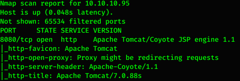

# Hack the box - Jerry


&nbsp;<span style="color:#b5e853; font-weight: bold">OS:  </span><b>Windows</b>
&nbsp;<span style="color:#b5e853; font-weight: bold">IP: </span><b>10.10.10.95</b>

&nbsp;<span style="color:#b5e853; font-weight: bold">Difficulity: </span><b>Easy</b>
&nbsp;<span style="color:#b5e853; font-weight: bold">Release: </span><b>2018 Jun 30</b>
&nbsp;<span style="color:#b5e853; font-weight: bold">Made by: </span><b>mrh4sh</b>

___

## Port scanning
```
nmap -sC -sV -T4 -oA nmap 10.10.10.95
```


There is only port 8080 open which indicates Apache Tomcat server.
___