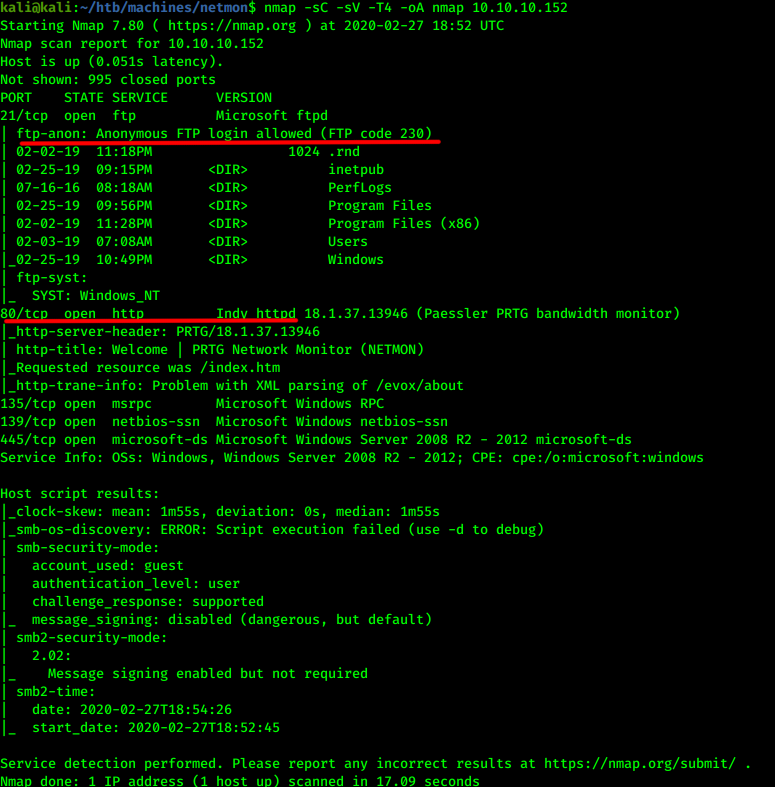
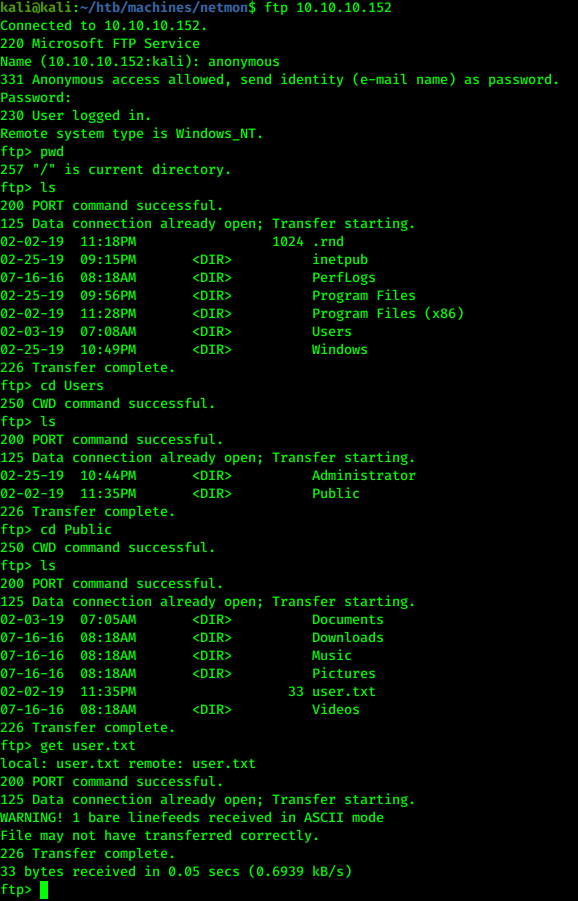
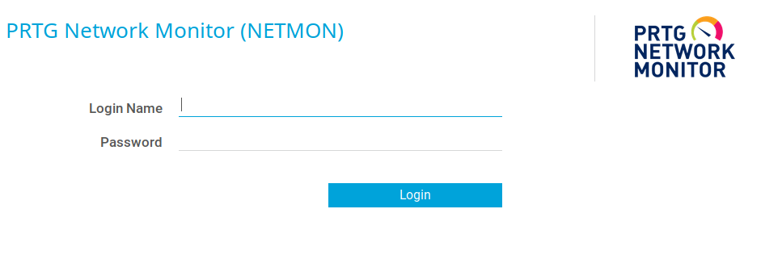
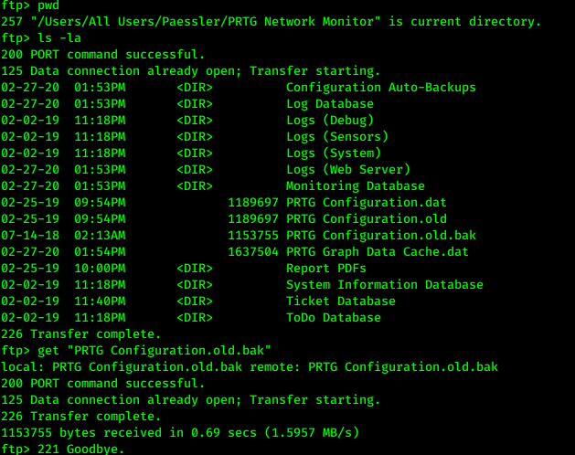
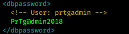
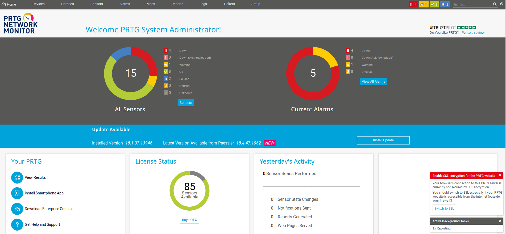
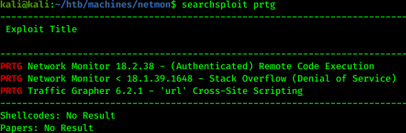
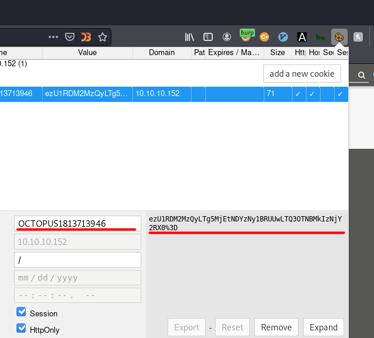
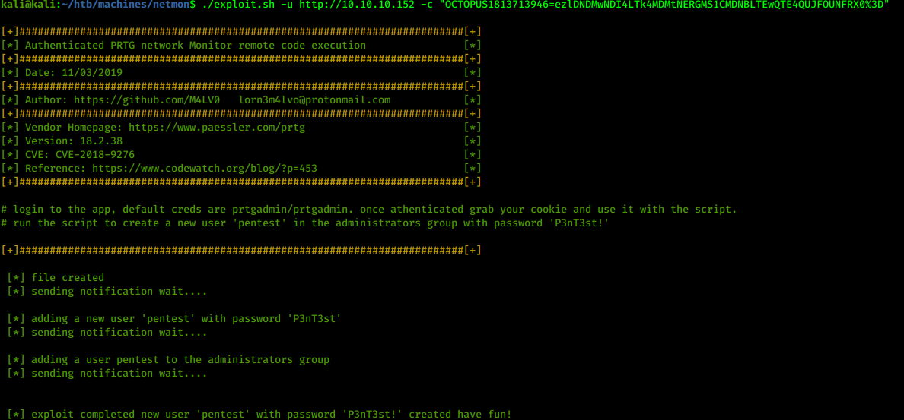
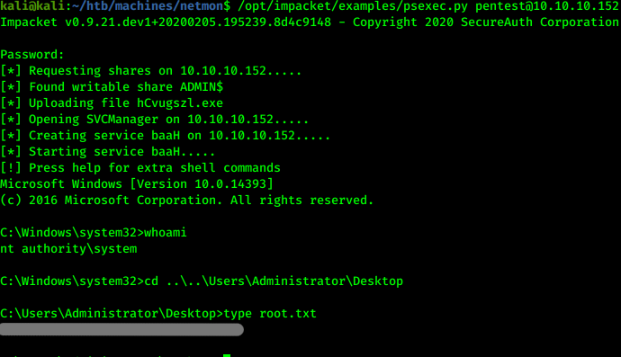

# Hack the box - Netmon


&nbsp;<span style="color:#b5e853; font-weight: bold">OS:  </span><b>Windows</b>
&nbsp;<span style="color:#b5e853; font-weight: bold">IP: </span><b>10.10.10.152</b>

&nbsp;<span style="color:#b5e853; font-weight: bold">Difficulity: </span><b>Easy</b>
&nbsp;<span style="color:#b5e853; font-weight: bold">Release: </span><b>2019 Mar 2</b>
&nbsp;<span style="color:#b5e853; font-weight: bold">Made by: </span><b>mrb3n</b>

___

## Port scanning
```
nmap -sC -sV -T4 -oA nmap 10.10.10.152
```


We can quickly identify 2 potential targets - FTP login and web server.

## Getting user flag through anonymous FTP

From nmap scan we noticed that FTP server allow anonymous login. Inside we can find sensitive data:



## Privilege escalation through web service

On port 80 we have PRTG Network Monitor login screen:



Since we have ftp access, we could get login credentials using filesystem. Some users tend to leave backup files with sensitive data:



Login credentials found inside:



If we try to login with same credentials it won't work, so we can enumerate password numbers little bit with replacing 2018 with 2019. Finally, successful login with prtgadmin:PrTg@dmin2019:



Let's try to check if this version is vulnerable with searchsploit:



There is one version that could be potentialy vulnerable so we use that file:

```
searchsploit -x exploits/windows/webapps/46527.sh > exploit.sh
```

Remember to delete first lines of exploit because it won't work. We also have to get cookie in order to pass to the script. We could use burp suite or browser plugins for it. I am using cookie editor plugin:



We could easily run script after:



Exploit created admin user for use with pentest:P3nT3st! credentials. To get the shell, we could use psexec:

