# Hack the box - Popcorn


&nbsp;<span style="color:#b5e853; font-weight: bold">OS:  </span><b>Linux</b>
&nbsp;<span style="color:#b5e853; font-weight: bold">IP: </span><b>10.10.10.6</b>

&nbsp;<span style="color:#b5e853; font-weight: bold">Difficulity: </span><b>Medium</b>
&nbsp;<span style="color:#b5e853; font-weight: bold">Release: </span><b>2017 Mar 15</b>

___

## Port scanning
```
nmap -sC -sV -oA basic 10.10.10.6
```
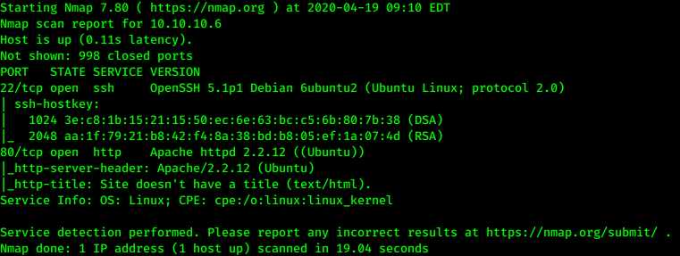

There is only web server and ssh service present on the target machine.

___

## Web fingerprinting

When we go to the main page, there is usual apache page running:

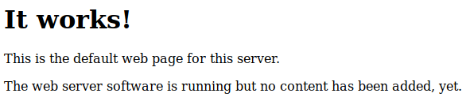

We could run ffuf for directory enumeration:

```
ffuf -w /usr/share/wordlists/dirbuster/directory-list-2.3-small.txt -u http://10.10.10.6/FUZZ
```

There is couple of directories that look interesting:

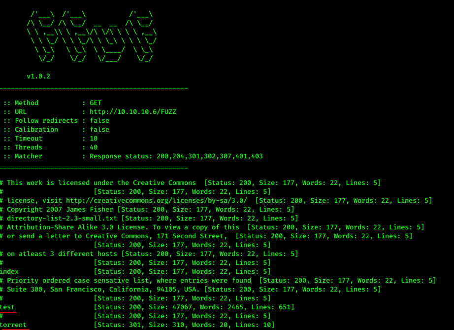

On test directory there is php info page:

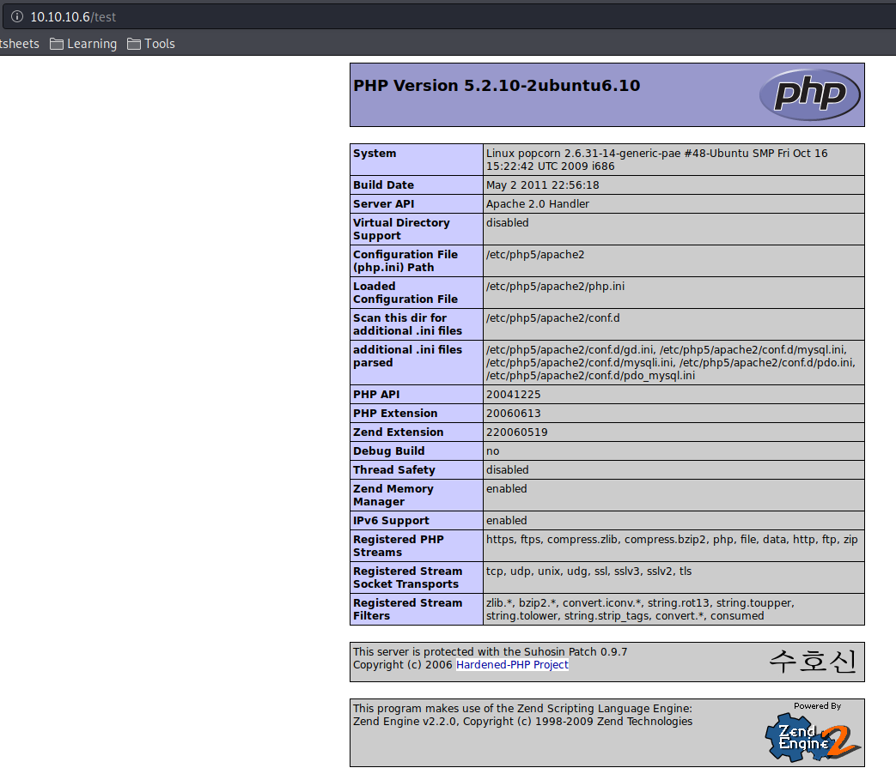

On torrent directory there is a Torrent Hoster web application that has upload functionality:

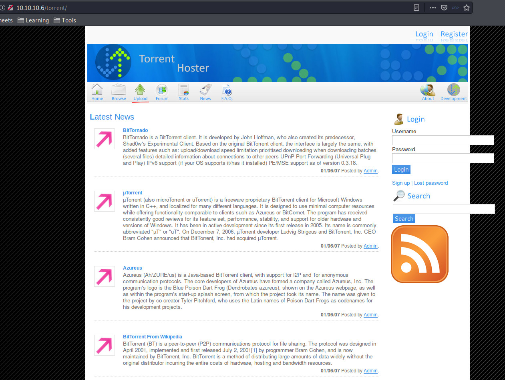

## Getting the reverse shell

Since web app uses php, we could download php reverse shell and try to upload it:

```
wget https://raw.githubusercontent.com/pentestmonkey/php-reverse-shell/master/php-reverse-shell.php
```

Also prepare change configuration in file and set up netcat listener:

```
nc -vlp 4444
```

Now register new user on web page and login:

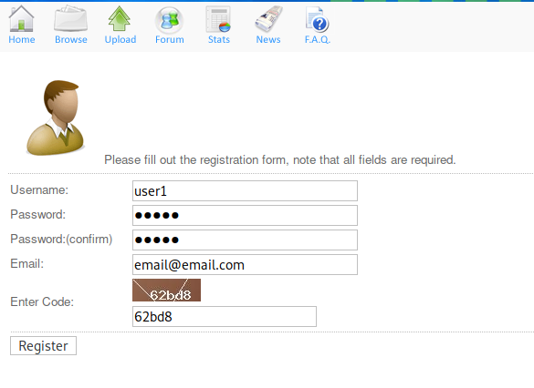

Try to upload .torrent file:

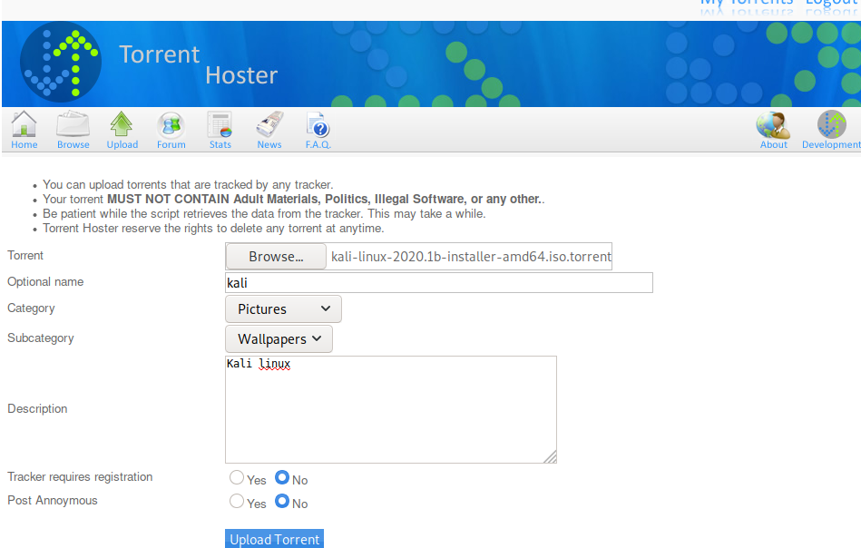

After successful upload, the app allows to edit torrent and add screenshot:

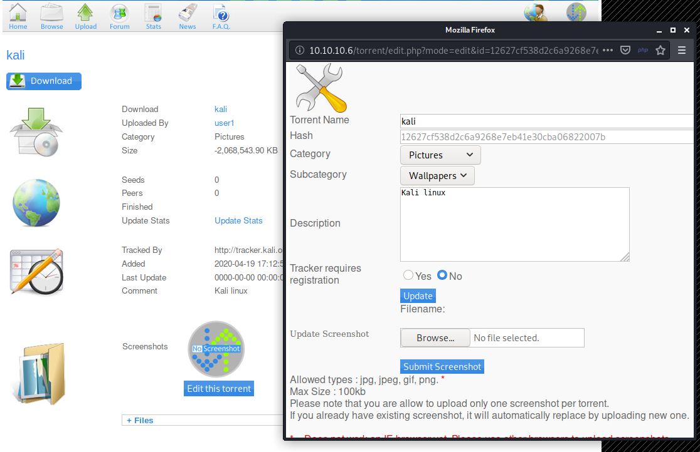

Let's intercept the image upload request using Burp Suite and send it to repeater:

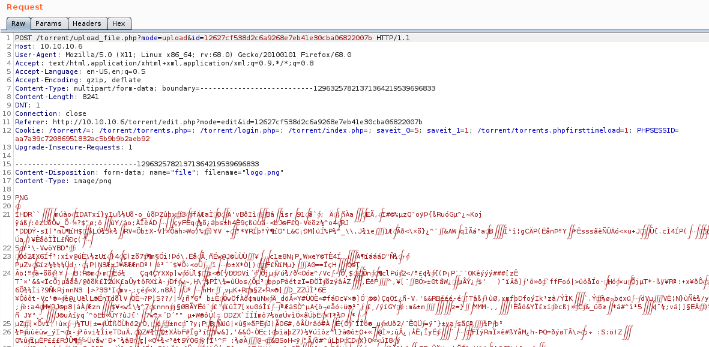

Now try to upload reverse shell and copy some contents from previous request:

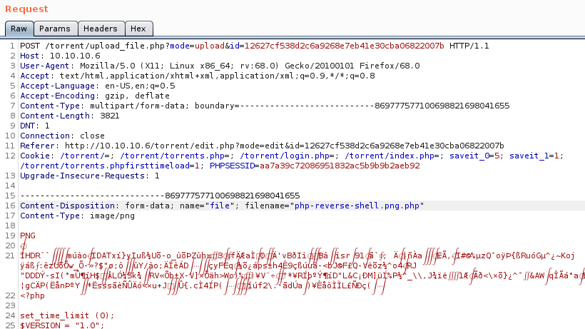

If we view image source near screenshots, it points to /torrent/upload/ page:

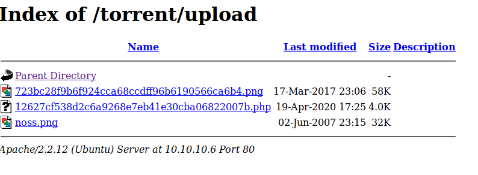

Click on .php file and you will get a shell session:

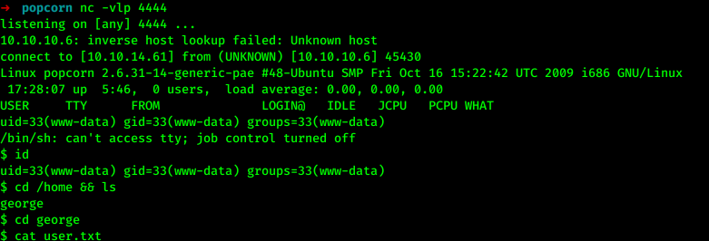

## Getting root

If we look closely to the home directory of the user, on the .cache directory, there is motd files located, so we could find privilege escalation exploit for that.

Prepare python server, download exploit, improve shell and run it:

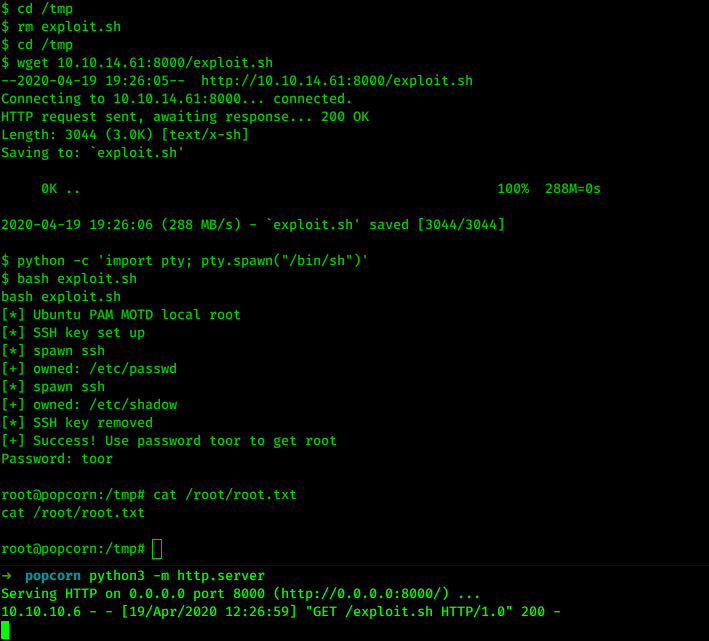

Congrats, we got the root!